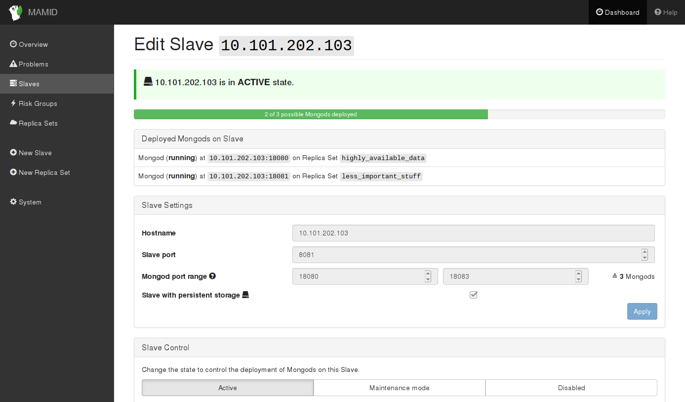

# What is MAMID?

MAMID is a manager for MongoDB database clusters, facilitating creation, administration and monitoring of Replica Set deployments. It was created as a student project for *Praxis der Softwareentwicklung* (software engineering) at the Karlsruhe Institute of Technology.

Explicit support for volatile storage on primary Replica Set members with lower-prioritized secondaries on persistent storage is a key differentiator of MAMID.

## System Components

### Master
* Monitors the Slaves
* Inserts Mongod instances into Replica Sets as needed while optimizing availability by respecting shared risks of failure
* Transfers Mongod instances to other Slaves on user request (e.g. in case of failure)

### Slave
* Spawns and kills Mongod instances
* Reports their status to the Master
* Accepts the configuration from the Master and applies it to the Mongods and their Replica Sets

### Notifier
* Sends email notifications in case of problems e.g. a slave is down

# [Development/Testing Setup](TESTING.md)

# [Development Workflow](CONTRIBUTING.md)

# [Installation on a Productive System](INSTALL.md)

# [User Manual](MANUAL.md)

